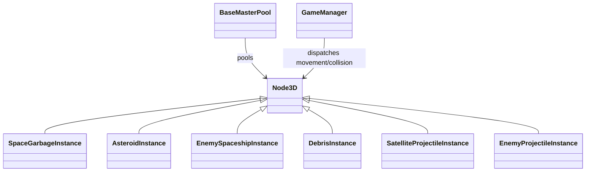

# VearthIncThreat (IdleSpace) - Godot Game Architecture & Code Documentation

This document outlines the current core classes, subsystems, and gameplay mechanics within the **VearthIncThreat** (IdleSpace) Godot 4 project. Older references to `ObjectPooler` and `Entity2D` describe a previous architecture; current runtime code uses `BaseMasterPool`, pooled `Node3D` instances, and centralized `GameManager` dispatch.

---

## 1. Project Overview & Architecture
The game is built in **Godot 4** around a flat XZ gameplay plane with 3D rendering.
* **Gameplay Layer**: Pooled entity instances are `Node3D` scripts. Movement, broadphase grid updates, and collision sweeps run through `GameManager` instead of one physics callback per entity.
* **2D Support Nodes**: `PlayerPlanet` and spawn markers still use 2D nodes where convenient, but threat positions are represented by X/Z coordinates in the 3D world.
* **Visual Layer**: Meshes render under `World3D`. Garbage, debris, and projectile visuals can be submitted to `MultiMeshRenderer` while gameplay instances remain pooled and addressable.

### Key Scene Relationships Diagram:
```mermaid
graph TD
    Main[main.tscn] --> GameManager[Autoload: GameManager]
    Main --> UpgradeManager[Autoload: UpgradeManager]
    Main --> Pools[BaseMasterPool Nodes]
    Main --> CameraController[CameraController Node]
    Main --> World2D[World2D Node2D]
    Main --> World3D[World3D Node3D]
    Main --> MultiMesh[MultiMeshRenderer]
    
    Pools -- Recycles -- Instances[Pooled Node3D Instances]
    GameManager -- Moves / Sweeps -- Instances
    Instances -- Registers Visuals -- MultiMesh
    World3D -- Renders -- Instances
```

### Current performance path

`GameManager` owns active movement, collision, damageable-target, and spatial-grid arrays. Entities register on activation and unregister on recycle. The spatial grid updates only when an entity crosses a cell boundary; collision sweeps run in a separate half-rate phase. `BaseMasterPool` uses swap-remove indexing for O(1) active-list removal, and `GameManager` reuses popup labels instead of allocating a tween per hit.

---

## 2. Autoloads & Global Managers

### `GameManager` (`game_manager.gd`)
Manages game state, run session credits, lifetime bank credits, game flow, centralized movement, collision phases, and the spatial broadphase.
* **State Machine (`GameState`)**: `PLAYING`, `PAUSED`, `UPGRADE_SCREEN`, `END_SESSION`, `VICTORY`, `TRANSITION`.
* **Properties**:
  - `run_credits`: Credits accumulated in the current run.
  - `lifetime_credits`: Credits saved in the permanent bank (used to buy upgrades).
  - `current_zone`: The current round / difficulty level.
  - `decay_timer` / `decay_time_limit`: Controls planet health decay progression.
  - `debris_chance`: The current probability of spawning debris projectile on threat death.
  - `spatial_grid`: Incremental XZ broadphase for nearby-target queries.
  - `_movement_entities`: Central movement-dispatch array.
  - `_collision_entities`: Separate collision-sweep array, currently processed every second physics frame.
  - `_active_damageable`: O(1)-indexed active target list used by cursor and projectile queries.
* **Key Methods**:
  - [change_state](file:///e:/GODOT/vearthIncThreat/src/autoloads/game_manager.gd#L57): Updates game state and handles cleanup (recycles all active actors on PAUSED or END_SESSION).
  - [add_credits](file:///e:/GODOT/vearthIncThreat/src/autoloads/game_manager.gd#L68): Adds credits to `run_credits` scaled by the `ResourceMultiplier` upgrade.
  - [spend_lifetime_credits](file:///e:/GODOT/vearthIncThreat/src/autoloads/game_manager.gd#L75): Deducts credits from permanent bank for purchases.
  - [start_next_round](file:///e:/GODOT/vearthIncThreat/src/autoloads/game_manager.gd#L90): Increments `current_zone`, resets `run_credits`, and reloads the active scene to start a new wave.
  - [reset_game](file:///e:/GODOT/vearthIncThreat/src/autoloads/game_manager.gd#L48): Resets run statistics, zeroes credits, and starts a fresh run.
  - `register_movement` / `unregister_movement`: Adds or removes an active instance from the centralized movement loop.
  - `register_collision` / `unregister_collision`: Adds or removes an instance from the lower-frequency collision phase.
  - `register_active_damageable` / `unregister_active_damageable`: Maintains the damageable list and spatial-grid membership.
  - `get_nearby_entities`: Queries only cells within the requested radius and reuses a result buffer.
  - `spawn_popup_3d`: Uses a fixed `Label3D` pool; drops low-priority popups when pool capacity is exhausted.

### `UpgradeManager` (`upgrade_manager.gd`)
Loads and manages the upgrades system.
* **Properties**:
  - `upgrades_list`: Array of all available `UpgradeData` resources.
  - `upgrades_by_id`: Dictionary of upgrades mapped by their unique string IDs.
  - `purchased_levels`: Player's current levels (`{ upgrade_id: int }`).
* **Key Methods**:
  - [load_all_upgrades](file:///e:/GODOT/vearthIncThreat/src/autoloads/upgrade_manager.gd#L22): Dynamically scans `res://src/resources/upgrades/` folder, handles internal Godot `.remap` resource suffixes during export, and loads all `.tres` files.
  - [get_upgrade_level](file:///e:/GODOT/vearthIncThreat/src/autoloads/upgrade_manager.gd#L49): Returns the level of the requested upgrade.
  - [is_upgrade_visible](file:///e:/GODOT/vearthIncThreat/src/autoloads/upgrade_manager.gd#L53): Determines if an upgrade should show in the skill tree (checking if prerequisite upgrades have level > 0).
  - [can_unlock_upgrade](file:///e:/GODOT/vearthIncThreat/src/autoloads/upgrade_manager.gd#L66): Validates if player can purchase the upgrade (checks visibility, current level < max level).
  - [purchase_upgrade](file:///e:/GODOT/vearthIncThreat/src/autoloads/upgrade_manager.gd#L77): Deducts permanent credits and increments upgrade level.
  - [get_multiplier](file:///e:/GODOT/vearthIncThreat/src/autoloads/upgrade_manager.gd#L94): Calculates the cumulative multiplier for a category using additive scaling:
    $$\text{FinalMultiplier} = 1.0 + \sum (\text{IndividualUpgradeMultiplier} - 1.0)$$

---

## 3. Core Framework & Spawning

### `BaseMasterPool` (`base_master_pool.gd`)
Controls entity memory management by pre-allocating and reusing `Node3D` scenes.
* **Pool Types**: Garbage, asteroids, enemy spaceships, debris, enemy projectiles, satellite projectiles, and satellites.
* **Key Methods**:
  - `borrow_instance`: Borrows a preallocated instance, with bounded steal/recycle fallback when a pool is full.
  - `return_to_pool`: Calls `on_pool_deactivate()`, disables processing, hides the instance, and returns it to the free list.
  - `return_all_active_to_pool`: Recycles all active instances during transitions and resets.
  - Active instances use swap-remove indexing, avoiding O(n) array erases.

### `MultiMeshRenderer` (`multi_mesh_renderer.gd`)
Groups repeated 3D visuals into `MultiMeshInstance3D` batches while gameplay entities remain pooled nodes.
* **Current groups**: `garbage`, `debris`, `enemy_projectile`, and `satellite_projectile`.
* **Lifecycle**: Entities register/unregister on pool activation/deactivation. The renderer updates transforms and visible instance counts from the active group arrays.
* **Rendering policy**: Batched visuals cast no shadows; individual mesh children are hidden after registration.

### `Spawner` (`spawner.gd`)
Orchestrates wave progression, spawning garbage resources, asteroids, and enemy spaceships.
* **Spawning Logic**:
  - Locates path-followers under `SpawnPath` to determine spawn coordinates.
  - Rolls against a random weighted spawn table to decide entity types.
  - Controls spawning rate, limits maximum active entity counts, and increments difficulty based on `current_zone`.
  - Spawns orbit garbage in chunks matching the number of available spawn points (e.g., 50). If the total garbage count exceeds the number of spawn points, it cascades the remaining garbage in chunks of the same size, delayed by 1.0 second per chunk.

### `SpawnPath` (`spawn_path.gd`)
A customized `Path2D` that draws and generates a spawning ring around the planet.
* **Properties**:
  - `circle_radius` (default `650.0`): The distance from the center planet at which threats spawn.
  - `spawner_count` (default `40`): Number of marker spawn points generated.

---

## 4. Entity Hierarchy & Behaviors



### Pooled instance lifecycle
All active threat/projectile scripts follow the same pool lifecycle.
* **Key Functions**:
  - `on_pool_activate`: Resets state, position, health, timers, visibility, and manager registrations.
  - `on_pool_deactivate`: Clears active state, unregisters movement/collision/grid/visual membership, and hides the instance.
  - `_manager_move`: Performs movement from the single `GameManager` physics loop.
  - `_manager_collision`: Performs optional collision sweep in the separate collision phase.
  - `take_damage` / `die`: Applies damage, emits pooled popup feedback, and returns the instance to its master pool.

### `SpaceGarbageInstance` (`space_garbage_instance.gd`)
The main resource entity. Travels inward from the spawn circle towards the planet `(0,0)`.
* **Key Features**:
  - Custom visual scaling (scales visual meshes relative to tier size).
  - Integrates `Massify` category upgrades (doubles HP, value, and collision damage).
  - Linear velocity is halved (`base_speed * 0.5`) when damaged to introduce hit slowdown.
  - Collision with planet shield (`global_position.length() < 45.0`) triggers damage to planet.
  - Grants credits on death and rolls for `DebrisProjectile` burst (requires `DA_UnlockDebrie_T0` to be unlocked).

### `AsteroidInstance` (`asteroid_instance.gd`)
Hostile space rocks that travel inward.
* **Key Features**:
  - Deals collision damage on reaching the planet.
  - Spawns debris projectiles on death if `DA_UnlockDebrie_T0` is unlocked.
  - Can collide with garbage, destroying it without granting credits.

### `EnemySpaceshipInstance` (`enemy_spaceship_instance.gd`)
Hostile ships that orbit the planet.
* **Key Features**:
  - Flies inward to reach `orbit_radius` (randomized approximately 160–240 units) and then revolves around the center.
  - Fires `EnemyProjectile` towards the planet on a cooldown interval.
  - Barrier bypass and fixed attack-slot navigation is planned in [Barrier_Navigation_TODO.md](Barrier_Navigation_TODO.md).

### `SatelliteInstance` (`satellite_instance.gd`)
Defensive satellites that orbit the planet.
* **Key Features**:
  - Requires `SatelliteUnlock` level > 0 to spawn.
  - Starts with 2 base satellites upon unlock, plus 1 per level of `SatelliteAmount` upgrade (up to a maximum of 16 satellites / 8 symmetric pairs).
  - Circles the planet continuously at a constant speed (scaled by `SatelliteSpeed` upgrade) without pausing to shoot.
  - 3D visual body is configured as a gold cone pointing outward.
  - Instantiated deferred via `add_child.call_deferred()` to prevent thread-blocking errors during scene initialization.
  - Fires `SatelliteProjectile` outward away from the planet (damage scaled by `SatelliteDamage` and speed by `SatelliteProjectileSpeed`).
  - 3D mesh is automatically rotated by `+ PI / 2.0` radians so its front (tip of the cone) faces the outward shooting direction.

### `SatelliteProjectileInstance` (`satellite_projectile_instance.gd`)
Projectiles spawned by defensive satellites.
* **Key Features**:
  - Travels outward from the planet in linear directions (direction set away from planet center).
  - Velocity scaled by `SatelliteProjectileSpeed` upgrade.
  - Damage scaled by `SatelliteDamage` upgrade.
  - Sweeps and inflicts damage (`take_player_damage` or `take_damage`) on `garbage`, `asteroid`, and `enemy` group targets within its collision circle.
  - Recycled back to the satellite projectile pool upon first hit or lifetime expiration (4 seconds).

### `DebrisInstance` (`debris_instance.gd`)
Projectiles spawned on threat deaths.
* **Key Features**:
  - Travels outward from the planet in linear directions.
  - Pierces through multiple threats based on `DebrisPiercing` upgrade.
  - Recycles itself when lifetime expires or it leaves the gameplay bounds.

---

## 5. Visuals & UI

### Rendering performance policy

The current high-count rendering configuration keeps post-processing and expensive per-object lighting disabled:

* Environment glow is disabled in `src/main/main.tscn`.
* Directional/imported mesh shadows are disabled.
* Emission is disabled in debris, enemy laser, satellite laser, and engine materials.
* Shield shader output writes zero emission; shield color/opacity remains available without bloom.
* Repeated projectile/debris visuals use `MultiMeshRenderer` where supported.

### `CameraController` (`camera_controller.gd`)
Manipulates the 3D orthographic camera view.
* **Methods**:
  - [_on_trigger_camera_animation](file:///e:/GODOT/vearthIncThreat/src/main/camera_controller.gd#L23): Zooms out the view (increases camera `size`) using a smooth tween when `DA_UnlockAsteroids` is purchased for the first time.

### `SkillTree` (`skill_tree.gd`)
Handles drawing of nodes, connector paths, and buying mechanics.
* **Methods**:
  - [_on_close_pressed](file:///e:/GODOT/vearthIncThreat/src/ui/skill_tree.gd#L124): Resumes playing and progresses to the next wave.
  - [show_tooltip](file:///e:/GODOT/vearthIncThreat/src/ui/skill_tree.gd#L129): Renders details card showing upgrade prices, current bonuses, and labels.

### `UpgradeSlotUI` (`upgrade_slot_ui.gd`)
Individually represents a single upgrade in the tree.
* **Key Custom Sizing & Animations**:
  - The root `PanelContainer` uses `StyleBoxEmpty` (completely transparent background).
  - The `IconButton` uses custom `StyleBoxFlat` with rounded corners (12px) modulated in purple `#39009C` via `self_modulate` to serve as a separate backdrop.
  - `IconRect` (holds the `.png` data asset icon) is sized to be exactly **25% smaller** than the button using `SIZE_SHRINK_CENTER` sizing flags and custom sizes (60x60 inside 80x80 container).
  - When purchased, the `IconButton` (the purple background) spins 405 degrees via a Tween while the `IconRect` remains completely static on top of it.

### `DebugMenu` (`debug_menu.gd`)
Developer panel toggled via `F12`.
* **Key Features**:
  - Allows adjusting run/lifetime credits and active zones.
  - Provides "+" and "-" level controls for all dynamically loaded upgrades.
  - Displays active zone and active satellite count (`Zone: X | Satellites: Y`).
